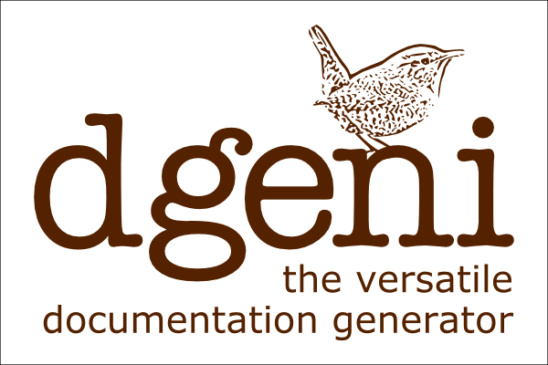

# Dgeni - 文档生成器 [](https://travis-ci.org/angular/dgeni)



用 angular.js 和其他工程构建的 node.js 文档生成工具。

## 入门

试试看 Dgeni [示例项目](https://github.com/petebacondarwin/dgeni-example)。或者你在找的是[用 AngularJS](https://github.com/petebacondarwin/dgeni-angular)的例子。

观看 Pete 在 ng-europe 上关于 Dgeni 的演讲：

[](http://youtu.be/PQNROxXajyQ)

## 安装

为了使用 Dgeni，你需要 node.js 和 npm 来安装 Dgeni 关联模块。从这里获取 node.js：
http://nodejs.org/.

然后在你想生成文档的工程目录下安装 Dgeni：

```
npm install dgeni --save-dev
```

这会安装 Dgeni 和 Dgeni 相关联的所有模块。

## 运行 Dgeni

对于 Dgeni 本身，你并不用做太多配置。但是你必须配置 **Packages**，它包含了 **Services**
和 **Processors** 两部分。其中 **Processors** 将会实际负责将你的源文件转换成文档文件。

为了执行 processors 我们需要创建一个新的 `Dgeni` 实例，给它指定需要加载的 **Packages** 。然后只需要调用该实例的 `generate()` 方法。 `generate()` 方法将以异步方式调用 
processors ，最后返回 **Promise** ，参数是生成的文档。

```js
var Dgeni = require('dgeni');

var packages = [require('./myPackage')];

var dgeni = new Dgeni(packages);

dgeni.generate().then(function(docs) {
  console.log(docs.length, 'docs generated');
});
```

### 从命令行运行

Dgeni 通常会和生成工具一起使用，比如说 Gulp 或者 Grunt ，不过它也可以通过命令行来运行。

如果你把 Dgeni 安装在全局环境下，然后你可以从任何地方运行它：

```bash
npm install -g dgeni
dgeni some/package.js
```

如果 Dgeni 只被安装到了本地，那么你需要指明正确的安装路径：

```bash
npm install dgeni
node_modules/.bin/dgeni some/package.js
```

或者你可以通过 npm script 来运行：

```js
{
  ...
  scripts: {
    docs: 'dgeni some/package.js'
  }
  ...
}
```


总之用法就是：


```bash
dgeni path/to/mainPackage [path/to/other/packages ...] [--log level]
```

你必须指定一个或多个 Dgeni Packages 的路径。以及设置(可选)日志级别。


## Packages

**Services**， **Processors**，配置文件和模板被打包到 `Package` 中。Packages
 还可以依赖别的 Packages。因此，你可以在已有的配置文件上，再定义你的自定义配置。

### 定义 Package

Dgeni 提供一个 `Package` 构造函数来创建新的 Packages。Package 实例中有用来注册 **Services** 和
**Processors** 的方法，以及可以设置 **Processors** 的属性：

```js
var Package = require('dgeni').Package;
var myPackage = new Package('myPackage', ['packageDepencency1', 'packageDependency2']);

myPackage.processor(require('./processors/processor1'));
myPackage.processor(require('./processors/processor2'));

myPackage.factory(require('./services/service1'));
myPackage.factory(require('./services/service2'));

myPackage.config(function(processor1, service2) {
  service2.someProperty = 'some value';
  processor1.specialService = service2;
});
```


## Services

Dgeni 大量使用 **Dependency Injection (DI)** 来实例化对象。那些需要用 DI 系统来实例化的对象必须提供一个 **factory function**，然后在 **Package** 中注册，或者作为 **Processor**，通过 `myPackage.processor(factoryFn)` 方式，或者作为 **Service**，通过 `myPackage.factory(factoryFn)` 方式。

### 定义 Service

factory function 的参数是需要能被 DI 系统找到的其它服务，或者是可以直接使用的实例。

**car.js**:
```js
module.exports = function car(engine, wheels) {
  return {
    drive: function() {
      engine.start();
      wheels.turn();
    }
  };
};
```

这个例子中，我们定义了一个 `car` service，它依赖其它两个定义在别处的 services， `engine` 和 `wheels`。注意，`car` service 并不关心这些依赖是怎样工作的，也不关心它们在哪里定义。 只要在它需要的时候 DI 系统能正确的提供即可。

被 factory function 返回的 `car` service 是一个对象，包含了一个方法， `drive()`，用来调用 `engine` 和 `wheels` 的方法。


### 注册 Service

然后你需要将你的 Service 注册给 Package：

**myPackage.js**:
```jsv
var Package = require('dgeni').Package;

module.exports = new Package('myPackage')
  .factory(require('./car'));
```

这样 car Service 就可以被其他的 Service，Processor 或者配置块使用了：

```js
var Package = require('dgeni').Package;

module.exports = new Package('greenTaxiPackage', ['myPackage'])

  .factory(function taxi(car) {
    return {
      orderTaxi: function(place) { car.driveTo(place); }
    };
  })

  .config(function(car) {
    car.fuel = 'hybrid';
  });
```


## Processors

**Processors** 是包含了 `$process(docs)` 方法的 **Services**。 processors 在 pipeline 中是按照顺序一个个执行的。每个 Processor 可以从前一个 Processor 获取生成的文档集合，并可以操作它，你可以插入新的文档或插入元数据。

Processors 可以设置一些属性，告诉 Dgeni 它们应该在管道的哪部分执行，以及如何验证 Processor 配置。

* `$enabled` - 如果设为 `false` ，该 Processor 将不会被纳入 pipeline
* `$runAfter` - 一组 Processor 名字字符串，它们在 pipeline 中必须出现
**早于** 该 Processor。
* `$runBefore` - 一组 Processor 名字字符串，它们在 pipeline 中必须出现
**晚于** 该 Processor。
* `$validate` - Dgeni 用于验证该 Processor 属性的约束对象 [http://validatejs.org/](http://validatejs.org/)。


### 定义 Processor

你可以像定义 Service 一样定义 Processor：

**myDocProcessor.js**:
```js
module.exports = function myDocProcessor(dependency1, dependency2) {
  return {
    $process: function (docs) {
        //... do stuff with the docs ...
    },
    $runAfter: ['otherProcessor1'],
    $runBefore: ['otherProcessor2', 'otherProcessor3'],
    $validate: {
      myProperty: { presence: true }
    },
    myProperty: 'some config value'
  };
};
```


### 注册 Processor

然后你要将 Processor 注册到 Package：
**myPackage.js**:
```jsv
var Package = require('dgeni').Package;

module.exports = new Package('myPackage')
  .processor(require('./myDocProcessor'));
```

### 异步 Processing

`$process(docs)` 方法可以使用同步或者异步方式调用：

* 如果用同步方式，它将会返回 `undefined` 或者一组新的文档。如果返回的是一组新的文档，它将会取代之前的 `docs`。
* 如果用异步方式，它将会返回 **Promise**，最终处理结果将会是 `undefined` 或一组新的文档。如果返回的是 **Promise**，该 processor 告诉 Dgeni 它是以异步方式执行，这样 Dgeni 将会等待到该 promise 处理完毕，才会继续调用下一个 processor。


下面是一个使用异步 **Processor** 的例子
```js
var qfs = require('q-io/fs');
module.exports = function readFileProcessor() {
  return {
    filePath: 'some/file.js',
    $process(docs) {
      return qfs.readFile(this.filePath).then(function(response) {
        docs.push(response.data);
      });
    }
  };
```

### 标准 Dgeni Packages

[dgeni-packages repository](https://github.com/angular/dgeni-packages) 包含了许多预设 Processors -
从简单到复杂，以及 angular.js 特供版。这些 processors 在 Package 中被分为：

* `base` -  包含有基本文件读写的基础 Processors，作为一个抽象的渲染 Processor 存在。

* `jsdoc` - 依赖 `base` ，并添加了一些 Processors 和 Services，用于支持从代码注释中处理 jsdoc 样式标签。

* `nunjucks` - 提供了 [nunjucks](http://mozilla.github.io/nunjucks/) 基本渲染引擎。

* `ngdoc` - 依赖 `jsdoc` 和 `nunjucks` 并添加了额外的处理，适用于将 AngularJS 扩展用到 jsdoc。

* `examples` - 依赖 `jsdoc` ，并提供了 Processors，用于将示例代码从 jsdoc 注释中抽取出来，并将它们提取成可以执行的文件。

* `dgeni` - 支持将 dgeni Packages 文档化。


### 伪标记 Processors

你可以定义一些不处理任何事的，只作为处理流程阶段标记的 processor。你可以把它们应用到 `$runBefore` 和 `$runAfter` 属性中，确保你的 Processor 能在正确的时间点被执行了。

在 dgeni-packages 的  **Packages** 中定义一些标记 processors。下面是一个顺序列表，Dgeni 会将它们按照这个顺序添加到 pipeline 的处理中去：


* reading-files *(定义在 base)*
* files-read *(定义在 base)*
* parsing-tags *(定义在 jsdoc)*
* tags-parsed *(定义在 jsdoc)*
* extracting-tags *(定义在 jsdoc)*
* tags-extracted *(定义在 jsdoc)*
* processing-docs *(定义在 base)*
* docs-processed *(定义在 base)*
* adding-extra-docs *(定义在 base)*
* extra-docs-added *(定义在 base)*
* computing-ids *(定义在 base)*
* ids-computed *(定义在 base)*
* computing-paths *(定义在 base)*
* paths-computed *(定义在 base)*
* rendering-docs *(定义在 base)*
* docs-rendered *(定义在 base)*
* writing-files *(定义在 base)*
* files-written *(定义在 base)*


## 配置文件

你可以在 **Package** 中配置 **Services** 和 **Processors** 或者通过对 **Package** 注册 **Configuration Blocks** 来适用设定。这有一些可以由 DI 系统注入到 **Services** 和 **Processors** 中的方法，你可以用来设定它们的属性。


### 注册配置块

你可以在 Package 上调用 `config(configFn)` 注册 **Configuration Block** 。

```js
myPackage.config(function(readFilesProcessor) {
  readFilesProcessor.sourceFiles = ['src/**/*.js'];
});
```